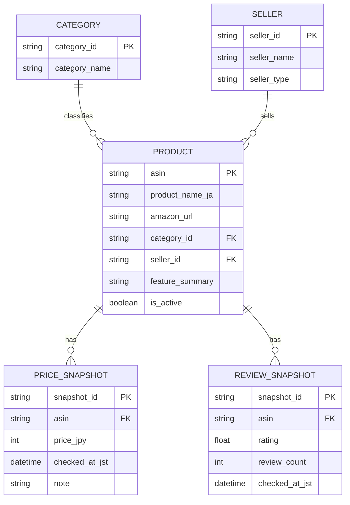

# Amazon.co.jp 女性向け防犯グッズ調査報告

## エグゼクティブサマリー

指定ガイドの掲載意図を踏まえ、Amazon.co.jp 上の女性向け掲載に相性がよい **防犯ブザー・窓/ドア用アラーム・ライト・見守りカメラ/ドアベル** を中心に、**重複・販売停止相当を除いた31商品**を整理しました。指定ガイドには「防犯ブザー」「護身グッズ」「防犯カメラ」などの導線がありましたが、今回の納品一覧はサイト公開時の扱いやすさを優先し、**非武器系カテゴリを中核**に構成しています。Amazon表示は商品によって、通常価格が明示されるもの・プライム会員価格のみ見えるもの・カート追加後でないと価格が見えないものが混在していたため、**取得不能な値は「未指定」**で統一しました。 citeturn0view0turn25view1turn46view1turn51search0

本調査で整理した内訳は、**防犯ブザー16件、窓・ドア用アラーム7件、監視カメラ・ドアベル6件、ライト2件**です。価格が取得できた15件のレンジは **945円〜15,840円**、中央値は **2,180円**でした。これは、サイトの導入導線としては「携帯アラーム」と「窓/ドア用アラーム」を先頭に置き、上位価格帯の「見守りカメラ・ドアベル」を後段に置く構成がもっとも実務的であることを示しています。

## 調査条件と編集方針

調査日時は **2026-06-07 12:34:16 JST** です。 citeturn52time0

対象は **Amazon.co.jp の新品商品中心**とし、商品ページ・Amazon検索結果・メーカー公式ページを優先ソースにしました。商品名・直リンクは `/dp/ASIN` 形式へ正規化し、販売者・価格・レビューは Amazon 表示を優先、確認できない項目は **未指定**にしました。Amazon 側では、プライム会員価格のみ表示される商品や、カート追加後にしか詳細価格が見えない商品が実際に混在しています。 citeturn46view1turn25view1turn35search1turn51search0

「女性向け」は、商品名や説明で **女性・女の子・一人暮らし**等の文言があるもの、または **軽量・携帯性・夜道や帰宅時・一人暮らしの窓/玄関対策**として使いやすいものを中心に解釈しました。たとえば、携帯アラーム系は「女性」「女の子」への言及が多く、窓/ドア用アラーム系は賃貸や一人暮らし向け訴求が目立ちます。 citeturn18search7turn29view3turn31search20

同内容のCSVは次からダウンロードできます。  
[CSVファイルをダウンロード](sandbox:/mnt/data/amazon_security_products_ja.csv)

## 商品一覧

表内の価格は、**調査時点の Amazon 表示価格**です。価格が取得できないものは **未指定** とし、CSV には `価格取得メモ` 列も付けています。 citeturn46view1turn25view1turn51search0

**カテゴリ: 防犯ブザー**

| 商品名 | 税込価格 | Amazon直リンク | 販売者 | ASIN | 主な特徴 | レビュー数 / 評価 | 出典 |
|---|---:|---|---|---|---|---|---|
| エルパ(ELPA) Me'more 防犯アラーム AKB-01BK | ¥1,991 | [Amazon](https://www.amazon.co.jp/dp/B0GKLRSCWT) | 未指定 | B0GKLRSCWT | 90dB大音量／生活防滴／誤作動防止／マグネット付 | 465件 / 4.0 | Amazon: citeturn4view0turn5view0turn6view0 |
| Hion 防犯ブザー USB充電式 TYPE-C LEDライト付き 防犯アラーム 黒 | 未指定 | [Amazon](https://www.amazon.co.jp/dp/B0C5MVW7QR) | 未指定 | B0C5MVW7QR | Type-C充電／130dB／LEDライト／防水／振動感知警報 | 1,189件 / 4.2 | Amazon: citeturn18search7 |
| 防犯ブザー USB充電式 Type-Cアップグレード LEDライト付き ブルー | ¥949 | [Amazon](https://www.amazon.co.jp/dp/B09B9RBZ8Q) | 未指定 | B09B9RBZ8Q | Type-C充電／130dB／LEDライト／防水 | 1,552件 / 4.1 | Amazon: citeturn23search1turn22view2 |
| Hion 防犯ブザー 2個セット 黒+白 130dB LEDライト付き | ¥1,999 | [Amazon](https://www.amazon.co.jp/dp/B08ZNHD7PG) | CRJ直営店 | B08ZNHD7PG | 2個セット／130dB／LEDライト／防水 | 2,408件 / 3.9 | Amazon: citeturn23search2turn24view0turn24view1turn22view2 |
| Hion 防犯ブザー USB充電式 オリジナル 振動感知警報・窓侵入防止 黒+白 | 未指定 | [Amazon](https://www.amazon.co.jp/dp/B0CZ475T87) | CRJ直営店 | B0CZ475T87 | Type-C充電／振動感知警報／窓侵入防止／LEDライト | 1,182件 / 4.2 | Amazon: citeturn27search1turn47view0turn47view1 |
| 防犯ブザー 充電残量アラーム Type-C充電 1年持続モデル | 未指定 | [Amazon](https://www.amazon.co.jp/dp/B0DZ5KMNDT) | 未指定 | B0DZ5KMNDT | 未使用充電で約1年持続／残量アラーム／Type-C充電／LEDライト | 456件 / 4.6 | Amazon: citeturn21search3 |
| 〖2024最新〗夜歩き護身+窓侵入防止両用 防犯ブザー ブルー | ¥1,299 | [Amazon](https://www.amazon.co.jp/dp/B0C8DC5JYM) | ワイルドアース | B0C8DC5JYM | 135dB／振動センサー／窓用兼用／Type-C充電／ライト付き | 251件 / 4.1 | Amazon: citeturn23search3turn45view0turn45view1turn22view2 |
| 〖100万個突破〗防犯ブザー 130dB LEDライト付き ブルー | ¥949 | [Amazon](https://www.amazon.co.jp/dp/B093D8PKG3) | CRJ直営店 | B093D8PKG3 | 130dB／LEDライト／防水／ランドセル向け | 2,406件 / 3.9 | Amazon: citeturn23search6turn42view0turn42view1turn42view3 |
| レイメイ藤井 防犯ブザー 生活防滴 防水 ブルー EBB131A | ¥945 | [Amazon](https://www.amazon.co.jp/dp/B01871BJ2Q) | Amazon.co.jp | B01871BJ2Q | 生活防滴／防水／LED点滅／テスト用電池付属 | 1,973件 / 4.3 | Amazon: citeturn43search3turn44view4turn44view5turn44view6 |
| アスミックス(Asmix) アスカ プリンセス防犯ブザー ショコラ GE076ON | 未指定 | [Amazon](https://www.amazon.co.jp/dp/B0G5BQ2JYS) | Amazon.co.jp | B0G5BQ2JYS | 誤作動防止SW／菓子モチーフ／かわいいデザイン | 106件 / 4.3 | Amazon: citeturn43search12turn44view0turn44view1 |
| アスカ プリンセス防犯ブザーシリーズ ポンポン GE084BE ベージュ | 未指定 | [Amazon](https://www.amazon.co.jp/dp/B0CLL9YHVR) | 未指定 | B0CLL9YHVR | ポンポン型／ふわふわ質感／かわいいデザイン | 未指定 / 4.0 | Amazon: citeturn43search4turn43search8 |
| TOKAIZ 防犯ブザー THG-SB01 | 未指定 | [Amazon](https://www.amazon.co.jp/dp/B0DG5SS977) | 未指定 | B0DG5SS977 | Type-C充電／最大約1年バッテリー／残量通知／2つのLEDライト／生活防水 | 未指定 / 未指定 | Amazon・公式: citeturn27search0turn28search1 |
| IPT 防犯ブザー ハート型 MSA-801 | 未指定 | [Amazon](https://www.amazon.co.jp/dp/B08BNTYZS3) | 未指定 | B08BNTYZS3 | ハート型／130dB／小型LEDライト／子供・女性向け | 未指定 / 未指定 | Amazon: citeturn43search2 |
| ism 防犯ブザー ハート型 MSA-801-BK | 未指定 | [Amazon](https://www.amazon.co.jp/dp/B0C7GDLYVB) | 未指定 | B0C7GDLYVB | 黒ハート型／130dB／小型LEDライト | 未指定 / 未指定 | Amazon: citeturn43search6 |
| 防犯ブザー 大音量125dB ハート型 LEDライト付き 押すタイプ | 未指定 | [Amazon](https://www.amazon.co.jp/dp/B0G2YQ4THK) | 未指定 | B0G2YQ4THK | 125dB／ハート型／LEDライト／押すタイプ | 未指定 / 未指定 | Amazon: citeturn27search2 |
| 防犯ブザー 子ども用 女の子向け ハート型 LEDライト付き | 未指定 | [Amazon](https://www.amazon.co.jp/dp/B0FMFPSB5X) | 未指定 | B0FMFPSB5X | 約100〜130dB／LEDライト／交換ボタン電池／女の子向け | 未指定 / 未指定 | Amazon: citeturn27search12 |

**カテゴリ: 窓・ドア用アラーム**

| 商品名 | 税込価格 | Amazon直リンク | 販売者 | ASIN | 主な特徴 | レビュー数 / 評価 | 出典 |
|---|---:|---|---|---|---|---|---|
| スマアラーム 窓用防犯ブザー 2個入り ホワイト | 未指定 | [Amazon](https://www.amazon.co.jp/dp/B0G2L3BVNR) | 防犯生活〖公式ストア〗 | B0G2L3BVNR | 125dB／貼るだけ設置／超薄型8.8mm／賃貸向け／防犯設備士監修 | 89件 / 4.1 | Amazon・公式: citeturn25view1turn26view0turn26view3turn28search7 |
| 防犯生活 振動センサー 防犯ドアアラーム 2個入り | ¥2,180 | [Amazon](https://www.amazon.co.jp/dp/B0DWM73Z1W) | 未指定 | B0DWM73Z1W | ドア・窓の振動検知／大音量警報／2個入り | 84件 / 3.9 | Amazon: citeturn50search5 |
| 防犯の女神 窓防犯アラーム 2個セット | ¥3,980 | [Amazon](https://www.amazon.co.jp/dp/B0G43C7LF5) | 未指定 | B0G43C7LF5 | 衝撃+開放ダブル検知／130dB／警告ステッカー付き／超薄型8.5mm | 44件 / 3.9 | Amazon: citeturn50search6turn26view2 |
| TOKAIZ 防犯アラーム 窓・ドア用 THG-SA02 2個入り | ¥1,880 | [Amazon](https://www.amazon.co.jp/dp/B0FQTPWD58) | TOKAIZ（トカイズ）公式ストア | B0FQTPWD58 | 衝撃+開放検知／130dB／三段階感度調整／待機1年／工事不要 | 22件 / 4.2 | Amazon・公式: citeturn28search10turn29view0turn29view1turn28search2 |
| アイリスオーヤマ リモコン付き窓用防犯アラーム 2個セット SWA-W2 | ¥3,980 | [Amazon](https://www.amazon.co.jp/dp/B0GNZPQPM2) | アイリスオーヤマ公式ショップ | B0GNZPQPM2 | リモコン付き／衝撃検知／警告ラベルテープ／2個セット | 1件 / 4.0 | Amazon: citeturn51search0turn51search6turn26view2 |
| エルパ(ELPA) 窓ピタッアラーム 衝撃＋開放検知式 2P ASA-W13-N2P | 未指定 | [Amazon](https://www.amazon.co.jp/dp/B0CP7K3SQN) | 未指定 | B0CP7K3SQN | 約90dB／約25秒警報／衝撃+開放検知／貼るだけ／厚さ約8mm | 未指定 / 未指定 | Amazon・公式: citeturn50search0turn50search4 |
| スマアラーム 窓用防犯ブザー 計6個 ブラック | 未指定 | [Amazon](https://www.amazon.co.jp/dp/B0G2LBV2W3) | 防犯生活 | B0G2LBV2W3 | 125dB／計6個／超薄型8.8mm／賃貸向け／防犯設備士監修 | 88件 / 4.1 | Amazon・公式: citeturn51search2turn28search11 |

**カテゴリ: ライト・キーホルダーライト**

| 商品名 | 税込価格 | Amazon直リンク | 販売者 | ASIN | 主な特徴 | レビュー数 / 評価 | 出典 |
|---|---:|---|---|---|---|---|---|
| [Miflaier] キーチェーンライト 防犯キーチェーン | 未指定 | [Amazon](https://www.amazon.co.jp/dp/B0GGXZ4G5D) | 未指定 | B0GGXZ4G5D | USB急速充電／防水／ストロボ発光モード／コンパクトLEDライト | 未指定 / 未指定 | Amazon: citeturn41search0 |
| LEDキーチェーンライト 小型懐中電灯 高輝度LED | 未指定 | [Amazon](https://www.amazon.co.jp/dp/B0F846PZ38) | 未指定 | B0F846PZ38 | 高輝度LED／防水／軽量／キーホルダー付き | 未指定 / 未指定 | Amazon: citeturn41search1 |

**カテゴリ: 監視カメラ・ドアベル**

| 商品名 | 税込価格 | Amazon直リンク | 販売者 | ASIN | 主な特徴 | レビュー数 / 評価 | 出典 |
|---|---:|---|---|---|---|---|---|
| シャオミ(Xiaomi) スマートカメラ C301 | ¥3,638 | [Amazon](https://www.amazon.co.jp/dp/B0D7D7P84Q) | Amazon.co.jp | B0D7D7P84Q | 300万画素／双方向音声／AI人体検知／夜間撮影／360°ビュー | 1,040件 / 4.4 | Amazon・公式: citeturn30search3turn34view0turn34view1turn34view2turn30search9 |
| シャオミ(Xiaomi) スマートカメラ C302 | ¥4,080 | [Amazon](https://www.amazon.co.jp/dp/B0FQPHHRNN) | Amazon.co.jp | B0FQPHHRNN | 2K/3MP／物理レンズシールド／フルカラー暗視／Wi‑Fi 6／360°ビュー | 603件 / 4.6 | Amazon: citeturn35search0turn38view0turn38view1turn38view3 |
| TP-Link Tapo C200 | ¥3,980 | [Amazon](https://www.amazon.co.jp/dp/B07YG7RNF2) | Amazon.co.jp | B07YG7RNF2 | フルHD／動作検知／相互音声会話／夜間撮影／360°/114°パンチルト | 28,195件 / 4.4 | Amazon・公式: citeturn53search0turn18search8turn34view2turn53search1 |
| シャオミ(Xiaomi) ネットワークWi‑Fiカメラ C500 Dual | ¥8,680 | [Amazon](https://www.amazon.co.jp/dp/B0DX2C3JCC) | Amazon.co.jp | B0DX2C3JCC | デュアル400万画素／二重レンズ／AI検出／双方向音声／2方向同時監視 | 593件 / 4.6 | Amazon: citeturn36search1turn37view1turn37view2 |
| Anker Eufy Indoor Cam C220 | 未指定 | [Amazon](https://www.amazon.co.jp/dp/B0CQQQ5NZ1) | 未指定 | B0CQQQ5NZ1 | 2K画質／360°監視／AI動作検知／ズーム対応／Wi‑Fi対応 | 557件 / 3.8 | Amazon: citeturn35search1turn35search4turn35search7 |
| Aqara インターホン ワイヤレス 工事不要 G4 | ¥15,840 | [Amazon](https://www.amazon.co.jp/dp/B0BPHTL7MG) | AqaraDirectJP | B0BPHTL7MG | 工事不要／カメラ付きドアベル／人感検出／双方向音声／IPX3防水 | 未指定 / 未指定 | Amazon: citeturn31search20 |

## 集計と可視化

下図は、後掲一覧の **カテゴリ別件数** と、**価格が取得できた15商品の価格帯分布** を可視化したものです。棒グラフからは、防犯ブザーの掲載余地がもっとも大きく、次いで窓・ドア用アラーム、見守りカメラが続くことが分かります。ヒストグラムからは、掲載価格の中心が **1,000円台後半〜4,000円前後** に集まり、ドアベル/高機能カメラだけが上振れしていることが分かります。


ECサイト掲載の実務観点では、**トップページや比較導線には「防犯ブザー」と「窓・ドア用アラーム」を前段配置**し、**高単価のカメラ/ドアベルは補完カテゴリ**として扱うのが自然です。指定ガイドの文脈とも整合しやすく、価格感の段差も説明しやすくなります。 citeturn0view0turn29view3turn31search20

## HTMLカード例

以下は、一覧の中でも掲載バランスがよい **シャオミ(Xiaomi) スマートカメラ C301** をカード化した例です。価格・販売者・レビュー情報は Amazon 表示に基づいています。 citeturn30search3turn34view0turn34view2

```html
<article class="product-card" data-asin="B0D7D7P84Q" data-category="監視カメラ・ドアベル">
  <header class="product-card__header">
    <h3 class="product-card__title">シャオミ(Xiaomi) スマートカメラ C301</h3>
    <p class="product-card__price">税込 ¥3,638</p>
  </header>

  <div class="product-card__meta">
    <span class="badge">Amazon.co.jp</span>
    <span class="badge">ASIN: B0D7D7P84Q</span>
    <span class="badge">評価 4.4 / 5</span>
    <span class="badge">レビュー 1,040件</span>
  </div>

  <ul class="product-card__features">
    <li>300万画素の屋内見守りカメラ</li>
    <li>双方向音声通話に対応</li>
    <li>AI人体検知と夜間撮影</li>
    <li>360°ビューで室内全体を確認しやすい</li>
  </ul>

  <footer class="product-card__footer">
    <a class="button" href="https://www.amazon.co.jp/dp/B0D7D7P84Q" target="_blank" rel="noopener noreferrer">
      Amazonで見る
    </a>
  </footer>
</article>
```

実装上は、CSV をそのまま静的サイトへ流し込むよりも、**価格取得メモ** と **掲載可否フラグ** を別カラムで持たせるのが安全です。とくに Amazon では、通常価格・タイムセール・プライム会員価格が混在しうるため、ページ側で「価格更新確認日」を併記できるようにしておくと運用しやすくなります。 citeturn28search3turn46view1turn50search5

## データ設計

以下は、今回の納品物を指定サイトへ実装する際の最小 ER 図です。`product` を中心に、`category`、`seller`、`price_snapshot` を分けると更新運用がしやすくなります。



この構成にしておくと、**商品名・販売者・ASIN は比較的安定**、**価格とレビューはスナップショット更新**という Amazon 商品データの実態に合わせやすくなります。今回の CSV はそのまま初期投入に使えますが、本番では `checked_at_jst` を省略しない方がよいです。 Amazon 上でも価格表示のされ方が商品ごとに異なっていました。 citeturn25view1turn35search1turn51search0

CSV一式はこちらです。  
[amazon_security_products_ja.csv](sandbox:/mnt/data/amazon_security_products_ja.csv)